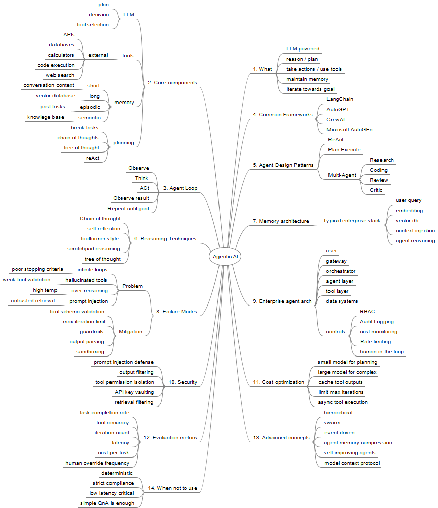

# Agentic AI Notes
## Mindmap

## Topics

- Place Holder

--------------------------------------------Details--------------------------------------
### Design Patterns
    1) ReAct
        - Definition: Reason and Act is a framework that allows LLMs to perform complex, multi-step tasks by interleaving reasoning and actions in a continuous loop. Introduced in 2022, this pattern moves text generation into the realm of autonomous decision making.

        - ReAct Loop: 
          > Structured cycle that mimics human problem solving.
          > Thought (Reasoning): Breaks down into smaller sub-tasks, identifies missing information and what tool to use next.
          > Action (Acting): Executes specific action based on the previous step
          > Observation (Result): Observes the outcome of its action, this info is passed back to the model for the next reasoning step.
          > Iteration: This loop repeats until the agent decides it has enough info to provide a final answer.

        - Benefits
          > Reduced hallucinations: Forcing the model to validate against real world data rather than guessing the answer
          > Dynamic adapatability: Unlike plan n execute, ReAct agents can pivot execution at real time.
          > Explainability: Trace exact logic and audit trail every decision, helping developers de-bug.

        - Popular Frameworks
          > LangChain | CrewAI | LlamaIndex | AutoGen
          
