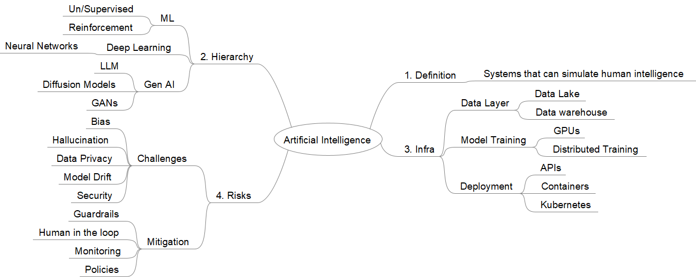

# Artificial Intelligence Notes
## Mindmap

## Topics
1. Definition
2. Hierarchy
3. Infra
4. Risks
--------------------------------------------------------------------------------------------------------------------------------------------------------------------------------------------
### Definition
    1. Simulate human intelligence
    
### Hierarchy
    1. ML (Un/supervised, Reinforcement)
    2. Deep Learning (NN)
    3. Gen AI (LLM. Diffusion Models, GANs)
    
### Infra
    1. Data Layer (Lake, warehouse)
    2. Model Training (GPUs, Distributed training)
    3. Deployment (APIs, Containers, Kubernetes)
    
### Risks
    1. Challenges
      - Bias
      - Hallucination
      - Data privacy
      - Model drift: Performance worsens over time because real world data has changed when compared to data on which it was trained. For instance, individual preference changes over time, market conditions shift.
          a. Types: 
            - Covariate (input data distribution changes / example: fraud patterns change)
            - Concept (input-output relation changes / example: new key words in spam detection)
            - Label (distribution of output label changes / example: customer churn rate increases due to market changes)
      - Security
      
    2. Mitigation
      - Guardrails
      - Human in loop
      - Monitoring
          a. Performance (accuracy, precision, recall)
          b. Data (compare training vs live data distribution)
          c. Retraining (with new data)
          d. A/B testing before replacing old ones.
      - Policies
