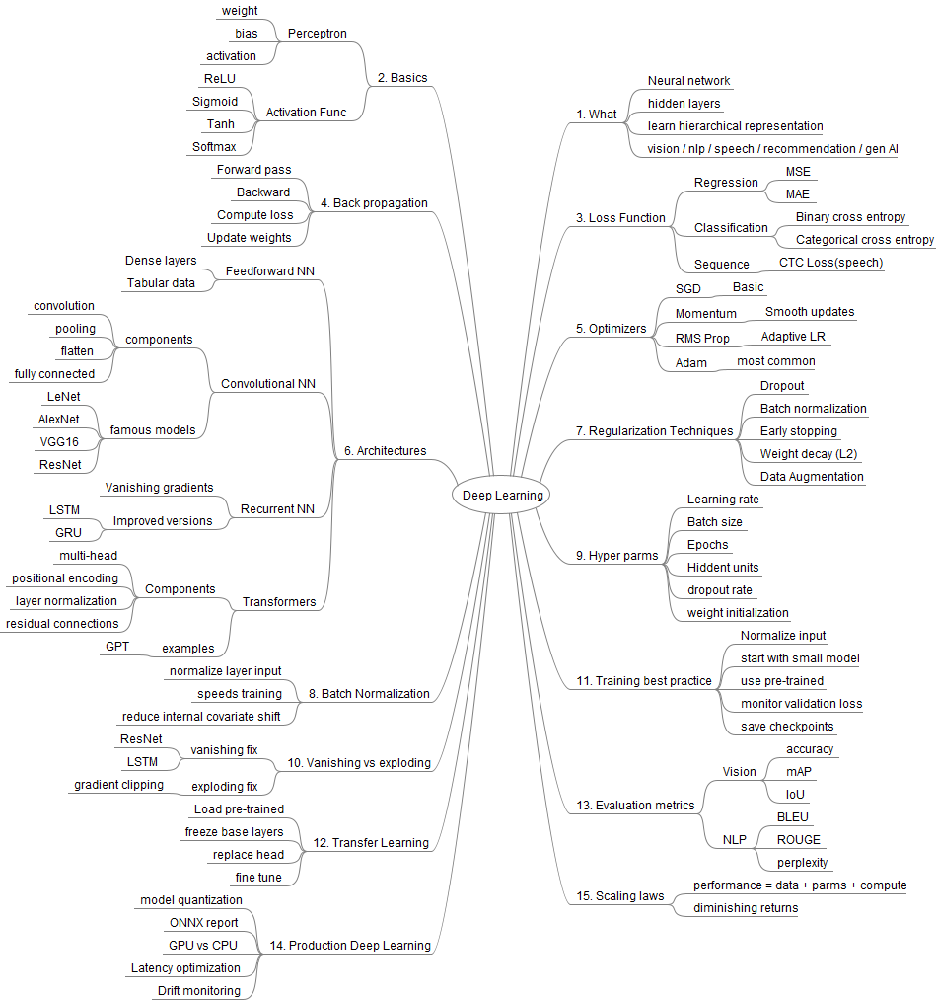

# Deep Learning Notes
## Mindmap

## Topics

- What
- Basics
- Loss Function
- Back Propagation
- Optimizers
- Architecture
- Regularization Techniques
- Batch Normalization
- Hyper Parms
- Vanishing vs Exploding
- Training Best Practices
- Transfer Learning
- Evaluation Metrics
- Production Deep Learning
- Scaling Laws

### What
- Neural Network
- Hidden Layers
- Learn Hierarchical Representation
- Vision / NLP / Speech / Recommendation / GenAI

### Basics
- Perceptron
    - Weight
    - Bias
    - Activation
- Activation Function
    - Sigmoid
    - Tanh
    - Softmax

### Loss Function
- Regression
    - MSE / MAE
- Classification
    - Binary Cross Entropy
    - Categorical Cross Entropy
- Sequence
    - CTC Loss (speech)
 
### Back Propagation
- Forward /Backward pass
- Compute Loss
- Update weights
  
### Optimizers
- SGD
    - Basic
- Momentum
    - Smooth updates
- RMS Prop
    - Adaptive LR
- ADAM
    - Most common
      
### Architecture
- Feedforward NN
    - Dense layers
    - Tabular data
- Convolutional NN
    - Components
      - Convolution / Pooling / Flatten / Fully Connected
    - Famous Models
      - LeNet / AlexNet / VGG16 / ResNet
- Recurrent NN
    - Vanishing gradients
    - Improved versions
      - LSTM / GRU
- Transformers
    - Components
      - Multi-head / Positional Encoding / Layer Normalization / Residual Connections
    - Example
      - GPT
        
### Regularization Techniques
- Drop out
- Batch Normalization
- Early Stopping
- Weight decay
- Data Augmentation

### Batch Normalization
- Normalize layer input
- Speeds training
- Reduce internal covariate shift
  
### Hyper Parms
- Learning Rate
- Batch size
- Epochs
- Hidden Units
- Dropout rate
- Weight Initialization
  
### Vanishing vs Exploding
- Fix
    - Vanishing: ResNet / LSTM
    - Exploding: Gradient clipping
      
### Training Best Practices
- Normalize input
- Start with small model
- Use pre-trained
- Monitor validation loss
- Save checkpoints
  
### Transfer Learning
- Load pre-trained
- Freeze base layers
- Replace head
- Finetune
  
### Evaluation Metrics
- Vision
    - Accuracy
    - mAP
    - IoU
- NLP
    - BLEU
    - ROUGE
    - Perplexity
      
### Production Deep Learning
- Model quantization
- ONNX report
- GPU vs CPU
- Latency optimization
- Drift monitoring
  
### Scaling Laws
- Performance
    - Data + parms + compute
- Diminishing returns
